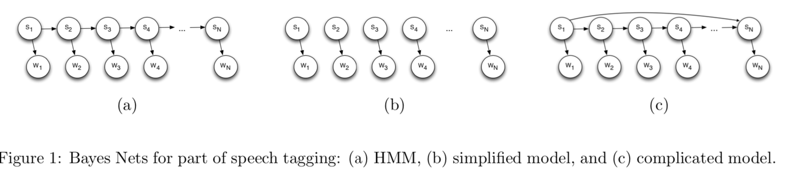

# Part 1: Part-of-speech tagging

Natural language processing (NLP) is an important research area in artificial intelligence, dating back to at least the 1950’s. A basic problems in NLP is part-of-speech tagging, in which the goal is to mark every word in a sentence with its part of speech (noun, verb, adjective, etc.). This is a first step towards extracting semantics from natural language text. For example, consider the following sentence: “Her position covers a number of daily tasks common to any social director.” Part-of-speech tagging here is not easy because many of these words can take on different parts of speech depending on context. For example, position can be a noun (as in the above sentence) or a verb (as in “They position themselves near the exit”). In fact, covers, number, and tasks can all be used as either nouns or verbs, while social and common can be nouns or adjectives, and daily can be an adjective, noun, or adverb. The correct labeling for the above sentence is:

```
Her position covers a number of daily tasks common to any social director
DET  NOUN     VERB DET NOUN  ADP ADJ  NOUN   ADJ   ADP DET  ADJ    NOUN

```
Fortunately, statistical models work amazingly well for NLP problems. Consider the Bayes net shown in Figure 1(a). This Bayes net has random variables S = {S1,...,SN} and W = {W1,...,WN}. The W’s represent observed words in a sentence. The S’s represent part of speech tags, so Si ∈ {VERB, NOUN, . . .}. The arrows between W and S nodes model the relationship between a given observed word and the possible parts of speech it can take on, P(Wi|Si). (For example, these distributions can model the fact that the word “dog” is a fairly common noun but a very rare verb.) The arrows between S nodes model the probability that a word of one part of speech follows a word of another part of speech, P(Si+1|Si). (For example, these arrows can model the fact that verbs are very likely to follow nouns, but are unlikely to follow adjectives.)

Data. To help you with this assignment, we’ve prepared a large corpus of labeled training and testing data. Each line consists of a sentence, and each word is followed by one of 12 part-of-speech tags: ADJ (adjective), ADV (adverb), ADP (adposition), CONJ (conjunction), DET (determiner), NOUN, NUM (number), PRON (pronoun), PRT (particle), VERB, X (foreign word), and . (punctuation mark).

What to do. Your goal in this part is to implement part-of-speech tagging in Python, using Bayes networks.



```
1. To get started, consider the simplified Bayes net in Figure 1(b). To perform part-of-speech tagging, we’ll want to estimate the most-probable tag si* for each word Wi, si* = argmax P(Si = si|W)
Implement part-of-speech tagging using this simple model.

2. Now consider Figure 1(a), a richer Bayes net that incorporates dependencies between words. Implement Viterbi to find the maximum a posteriori (MAP) labeling for the sentence, (s1*,...,sN*) = arg max P(Si = si|W)

3. Consider the Bayes Net of Figure 1c, which could be a better model because it incorporates longer- range dependencies between words. But it’s not an HMM, so we can’t use Viterbi. Implement Gibb’s Sampling to sample from the posterior distribution of Fig 1c, P(S|W). Then estimate the best labeling for each word (by picking the maximum marginal for each word, si* = argmax si P(Si = si|W). (To do this, just generate many (thousands?) of samples and, for each individual word, check which part of speech occurred most often.)

```
Your program should take as input a training filename and a testing filename. The program should use the training corpus to estimate parameters, and then display the output of Steps 1-3 on each sentence in the testing file. For the result generated by each of the three approaches (Simple, HMM, and Complex), as well as for the ground truth result, your program should output the logarithm of the posterior probability for each solution it finds under each of the three models in Figure 1. It should also display a running evaluation showing the percentage of words and whole sentences that have been labeled correctly so far. For example:
./label.py training_file testing_file

## Algorithm Used

```
Part of Speech tagging is achieved by using the following algortihms:
 1) Simplified Model
 2) Viterbi Algorithm
 3) Max Marginal(using Gibbs Sampling)

 TRAINING the DATA : We process the given training data, and learn the probabilities we would be needing to implement
 the algorithms mentioned above.
 The probabilities which we calculate using this process are :
 1) The probability that a particular speech comes as the first speech in a sentence
 2) The probability that a particular speech follows a given speech
 3) The probability of word given speech

 We use the above mentioned probabilities for our algorithms to follow.

 1) Simplified Model : The algorithm seems to be one of the most interesting ones, because being so simple, it returns more
 than 90% accuracy for us. In this algorithm we follow basics of Bayes. Procedure explained below :
     i) For each word in the sentence, we check for each speech and select the best among them and consider each word to be
     independent. From the training the data, we have the probability of word given speech which we utilize here.
     ii) Once selected a word, we comapare the probability for each speech given this word and multiply it with the
     probability of the speech. The max of this seems to be best suited result for the given word (because we consider
     them to be independent)

 Assumptions taken:
 If a word is not to be found in the training data, we were not able to get word given speech probability for that
 word. After experimenting with all the speech tags available, we found out that if we assign it as a noun, we get the
 best results. (which seems kind of obvious, because most probably any given data set could have different nouns.
 
 2) VITERBI or MAP : To find the best tag sequence, given sentence (or a word sequence), we need to compare all tag sequences.
 Viterbi allows us to do this dynamically and faster.
 Procedure followed while implementing the viterbi  explained below.
     i)  For the first word, the Viterbi coefficient doesnt depend on any transition but two probabilities.
     The probability that the speech comes first in a sentence and obviously,
     the probability of word given speech. We follow a matrix approach here where we maintain a forward matrix and store max   values or called Viterbi Coefficients.
     Thus, we have our first row of the forward matrix here.
     ii) For the second word, we use three probabilities. Emission probability, Transition probability and previous viterbi coefficient. We compute this for each speech tag for the word using viterbi coefficients for each speech tag. For any given particular speech, we take the max of the (transition probability from a speech * previous vierbi coefficient of it) an
     multiply it with the emission.
     iii) We conitnue doing this procedure for all words, and keep filling the forward matrix used by us. Also, for the backtrack, we also maintain that at each point, which previous
     Viterbi coefficient was used, which helps us determine the best path(or the best tag sequence) at the end.

 3) MCMC Gibbs Sampling and MAX Marginal: In gibbs sampling we generate samples. For each sample generation we change one observed value and keeping all observed value as constant and we get 12 probabilities for that observation Now after normalizing the 12 probabilities each corresponding to a particular part of speech for the observed value which we are changing . Now we calculated cumulative sum. A cumulative sum is a sequence of partial sums of a given sequence. For example, the cumulative sums of the sequence {a,b,c,...}, are a, a+b, a+b+c, ... Now we take a random value between 0 to 1 and see
 in which range it fall and for the particular range it fall we assign the appropriate part of speech for it. Similarly
 we do for all the words to produce a single sample. For MAX marginal, we generate 500 samples and we calculate the marginal
proababilities for each tag and return the best tag with highest probability for a particular word. We then return this
 tag for each word with its probability calculated over each the total number of samples generated.
 We have created a table P(Sn/Sn-1,S1) for the calculation of Gibbs sampling in order to sample values from the posterior distribution.
 P(S1) is proportional to P(S1)*P(S2/S1)*P(W1/S1)*P(Sn/Sn-1,S1)
 P(Sn) is proportional to P(Wn/Sn)*P(Sn/Sn-1,S1)
 P(Sn-1) is proportional to P(Wn-1/Sn-1) *P(Sn/Sn-1,S1) *P(Sn-1/Sn-2)
 

```


## Sample Output

```
./label.py bc.train bc.test

 ==> So far scored 2000 sentences with 29442 words.
                   Words correct:     Sentences correct: 
   0. Ground truth:      100.00%              100.00%
         1. Simple:       93.95%               47.60%
            2. HMM:       95.71%               58.10%
        3. Complex:       94.62%               51.45%
```


# Part 2: Code breaking

You’ve intercepted a secret message that is encrypted using both of two techniques. In Replacement, each letter of the alphabet is replaced with another letter of the alphabet. (For example, all a’s may have been replaced with f’s, b’s with z’s, etc.) Unfortunately, we don’t know the mapping that was used. In Rearrangement, the order of the characters is scrambled. For each consecutive sequence of n characters, the characters are reordered according to a function that maps character indices to character indices. For example, if n = 4 and the mapping function is f(0) = 2,f(1) = 0,f(2) = 1,f(3) = 3, then the string test would be rearranged to be estt (because the character at index 0 was moved to index 2, index 1 was moved to index 0, etc). We don’t know the mapping function that the encoder used, but we do know that n = 4.
How can we decrypt a document without knowing the encryption tables? Probabilistic methods come to the rescue. For any given sequence of characters, we can score how “English-like” it is by viewing language as simple a Markov chain over letters of the alphabet. We can define the probability that a document D was generated from the English language, P(D) = Πi P(Wi), where Wi is the i-th word of the document, and p(wi) = p(wi0) Π{j =1, |wi| - 1} (p{wi,j+1} | w{i,j})

where P(W{i,j}) refers to the j-th letter of word i. Now let’s say we randomly applied different decryption tables to an encrypted document. For each of those candidate decryptions D, we can calculate P(D), and then choose the one that is highest — the one that maximizes the likelihood of the data.

Unfortunately, trying all possible tables is impossible because the number of possible codes is unthinkably enormous — there are 26! possible replacement code books and 4! possible rearrangement codes, for a total of about 10 trillion quadrillion combinations. Here’s an alternative, based on something called the Metropolis-Hastings algorithm:

1. Start with a guess about the encryption tables. Call the guess T.
2. Modify T to produce a new guess, T′. The modification could be switching two letters in one of the
tables, for example.
3. Decrypt the encoded document using T to produce document D, and decrypt the document using T′
to produce D′.
4. If P(D′) > P(D), then replace T with T′. Otherwise, with probability P(D′)/P(D), replace T with T′.
5. Go to step 2.

Write a program to break codes of the above type. Your program should be run like this:

./break_code.py encoded_document english_corpus output

where encoded document is the name of a encrypted file, english corpus is a document containing some English text, and output is the file in which to write the final decrypted output. The purpose of the English corpus is to estimate the probabilities needed to compute the probabilities above. (Intuitively, the idea is that your program is searching for a code such that, when used to decrypt the document, the statistics of the decrypted document match the statistics of known English text.)
Your code should output the best possible decryption it can find within a time limit of about 10 minutes. You might want to consider variations on the above algorithm to improve performance, such as running the algorithm multiple times and using the best (highest-probability) result. Make sure to explain these design decisions in your report. For simplicity, you can assume that the input and output documents consist only of lowercase letters and spaces — no punctuation or capital letters.

## Algorithm Used

```
Initial Probabilities :  Created a table representing probability of each letter occuring first using the given corpus.
Transition Probabilities : Created a table representing all the transitions a combination of letters can take by joining the given corpus.

Both the probabilities were computed by taking the log form

1. Start with a guess about the encryption tables. Call the guess T

2. Modify T to produce a new guess, T′. This modification was done using a uniform distribution value, if the value from the distribution is greater than 0.5, then switch 2 numbers in rearrangement table else switch 2 letters in replace table

3. Decrypt the encoded document using T to produce document D, and decrypt the document using T′
to produce D′

4. If P(D′) > P(D), then replace T with T′. Otherwise, with probability P(D′)-P(D), replace T with T′. Computed the probability using uniform distribution with np.exp(P(D') - P(D)) 

5. Go to step 2.

After various runs, we concluded that the algorithm fairly converges in 20,000 iterations

```

## Sample Outputs

```
./break_code.py encrypted-text-1.txt corpus.txt output-encrypted-text-1.txt

hen in the ourse of human events it becomes necessary for one people to dissolve the political bands which have connected them with another and to assume among the powers of the earth the separate and equal station to which the aws....

```

```
./break_code.py encrypted-text-2.txt corpus.txt output-encrypted-text-2.txt

onures as the term is used by aviculturists include only the genera ratings and yrrhura as well as several single species genera and one double species genus these other genera are listed below....

```

```
./break_code.py encrypted-text-3.txt corpus.txt output-encrypted-text-3.txt

o  union is more profound than marriage for it embodies the highest ideals of love fidelity devotion sacrifice and family n forming a marital union two people become something greater than once they were s some of the petitioners in.....

```

```
./break_code.py encrypted-text-4.txt corpus.txt output-encrypted-text-4.txt

he illy ibrary located on the campus of ndiana niversity in loomington ndiana is an important rare book and manuscript library in the nited tates t its dedication on ctober   the library contained a collection of  books  manuscripts more than fifty oil paintings and  prints urrently the illy ibrary has.....

```
The entire output is uploaded in Part 2 folder with its respective names. The algorithm gives the right output 6 out of 10 times we run.

# Part 3: Spam classification


Let’s consider a straightforward document classification problem: deciding whether or not an e-mail is spam. We’ll use a bag-of-words model, which means that we’ll represent a document in terms of just an unordered “bag” of words instead of modeling anything about the grammatical structure of the document. If, for example, there are 100,000 words in the English language, then a document can be represented as a 100,000- dimensional vector, where the entries in the vector corresponds to a binary value — 1 if the word appears in the document and 0 otherwise. Of course, most vectors will be sparse (most entries are zero).

Implement a Naive Bayes classifier for this problem. For a given document D, we’ll need to evaluate
P(S = 1|w1,w2,...,wn), the posterior probability that a document is spam given the features (words) in
that document. Make the Naive Bayes assumption, which says that for any i != j, wi is independent from
wj given S. (It may be more convenient to evaluate the likelihood (or “odds”) ratio of P(S=1|w1,...wn)/ P(S=0|w1,...,wn) , and 
compare that to a threshold to decide if a document is spam or non-spam.)

To help you get started, we’ve provided a dataset in your repo of known spam and known non-spam emails, split into a training set and a testing set. Your program should accept command line arguments like this:
./spam.py training-directory testing-directory output-file

The training-directory can be assumed to contain two subdirectories called spam and notspam, containing email files that can be used to estimate the needed probabilities of the model. The testing-directory contains test emails, one per file; your program should output a output-file in a format like this:

00393.85c9cd10122736d443e69db6fce3ad3f spam
01064.50715ffeb13446500895836b77fcee09 notspam

and so on, where the first part of each line is a filename and the second is predicted class (spam or notspam).

## Algorithm used

```
1. Data with or without text Pre Processing

2. Calculate probability of a word being a spam and not spam using the training data given (Calculated log probabilities)

3. Given test data, calculate, P(S=spam|w1,...wn) and P(S= notspam|w1,...wn) using the probabilities calculated using step 2

4. If P(S=spam|w1,...wn) > P(S=notspam|w1,...wn) then assign the class as "Spam" else "Notspam". If the probabilities are equal then assign a random class

```

## Sample Outputs

Without Text Cleaning

```
./spam.py 'data/train' 'data/test' output.txt

Accuracy : 98.6%

```

With Text Cleaning

```
./spam.py 'data/train' 'data/test' output.txt

Accuracy : 95.9%

```
Accuracy was better when we tried running without pre processing of text. Also tried removing sparse words with very low count, but accuracy was better when we included all the words.


